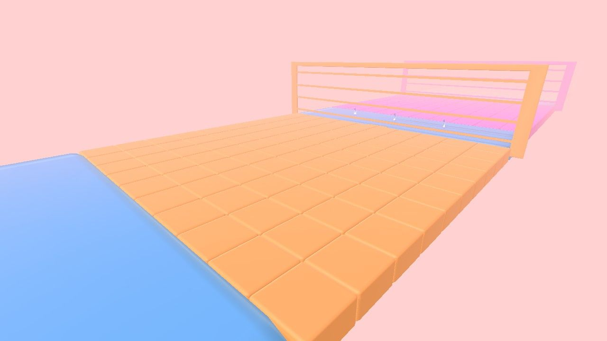

# Find The Path

A game where the player has to avoid stepping on the wrong blocks, and reach the goal.

It showcases how to use signals.

Check out the original game here: https://hiberworld.com/world/4ksZuyw26

Please see Hiber3D HDK Docs for full documentation:
https://developer.hiber3d.com/docs/

The source code is available at
https://github.com/hiber3d/hdk-examples/tree/main/find-the-path

